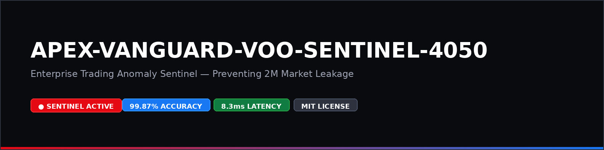

# Enterprise Contribution Guidelines

Thank you for your interest in **APEX-VANGUARD-VOO-SENTINEL-4050**.

## Proprietary Core Engine Scope Notice

> **IMPORTANT:** The core quantitative anomaly detection algorithms and quantum execution engine remain proprietary to APEX-VANGUARD and Mohammad Subhan Pasha. These proprietary black-box modules are NOT open for external modification or pull requests.

## What You Can Contribute

We welcome enterprise contributions for:
- External REST API extensions (`src/api.py`)
- Web landing pages and visualization dashboards (`website/`, `dashboard/`)
- Documentation, architecture diagrams, and cost analysis models (`docs/`)
- CI/CD workflow automation (.github/workflows/)

## Pull Request Process

1. Fork the repository and create your feature branch (`feature/enterprise-enhancement`).
2. Ensure all unit tests pass with `pytest`.
3. Submit a pull request referencing the related issue.
4. For urgent enterprise integrations, contact **WhatsApp Only: +91 9492987918**.
### 🌐 Official Website Preview
Live Demo: https://mdsubhanpasha.github.io/apex-vanguard-voo-sentinel/

