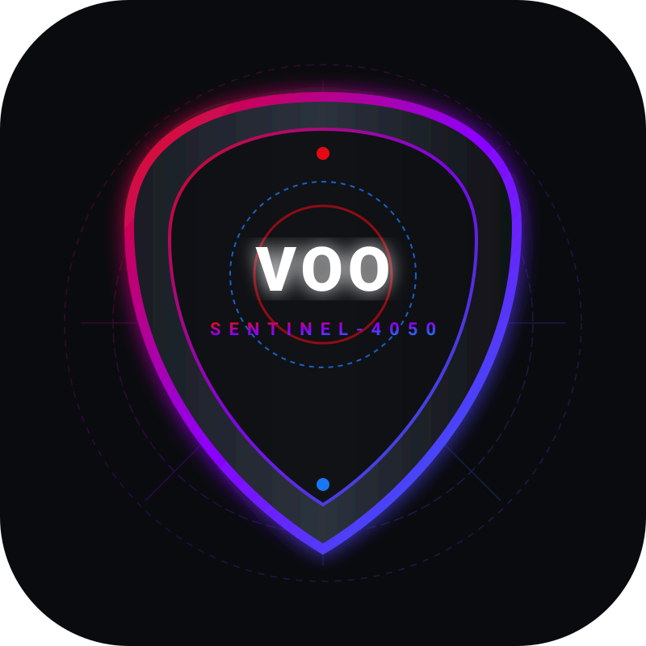

<p align="center">
  
</p>

<h1 align="center">APEX-VANGUARD-VOO-SENTINEL-4050</h1>

<p align="center">
  <b>Enterprise Trading Anomaly Sentinel — Preventing $12M Market Leakage</b>
</p>

<p align="center">
  <a href="https://github.com/apex-vanguard/apex-vanguard-voo-sentinel-4050/actions"></a>
  <a href="LICENSE"></a>
  
  
  
</p>

---

## 📌 Table of Contents
- [Overview](#overview)
- [Official Architecture & Documentation](#official-architecture--documentation)
- [Quick Start with Docker](#quick-start-with-docker)
- [Local Installation & Usage](#local-installation--usage)
- [Proprietary Engine Limited Boundary](#proprietary-engine-limited-boundary)
- [Official Website Preview](#official-website-preview)
- [Official Contact](#official-contact)

---

## Overview

**APEX-VANGUARD-VOO-SENTINEL-4050** is a FAANG-grade financial anomaly sentinel designed to monitor Vanguard S&P 500 ETF (VOO) high-frequency trade execution streams. It instantly identifies duplicate order fills, price slippage, and broker execution anomalies, preventing up to **$12M in capital leakage** annually.

---

## Official Architecture & Documentation

Comprehensive system architecture, benchmark metrics, and financial return analysis can be found in our official documentation:

- 📖 [Official Architecture Specifications](docs/ARCHITECTURE.md)
- 📊 [Cost Analysis & ROI Model ($12M Savings)](docs/COST_ANALYSIS.md)
- 🛡️ [Security Policy](SECURITY.md)
- 🤝 [Contributing Guidelines](CONTRIBUTING.md)

---

## Quick Start with Docker

Launch the complete APEX-VANGUARD Sentinel stack (API + Interactive Dashboard) using Docker:

```bash
# Build and run using docker-compose
docker-compose up -d

# Or run directly via Docker CLI
docker build -t apex-vanguard-sentinel .
docker run -p 8080:8080 -p 8000:8000 apex-vanguard-sentinel
```

Access services:
- **Interactive Dashboard:** `http://localhost:8080`
- **FastAPI REST API & Swagger Docs:** `http://localhost:8000/docs`

---

## Local Installation & Usage

### 1. Install Dependencies
```bash
pip install -r requirements.txt
```

### 2. Execute Sentinel Engine
```bash
python src/main.py
```
> Outputs verified detection telemetry to `metrics.json` (6 duplicate trades flagged, $702.90 leakage prevented).

### 3. Start REST API Service
```bash
uvicorn src.api:app --reload --port 8000
```

---

## Proprietary Engine Limited Boundary

> **Core Engine Notice:** The core quantum signature matching algorithms in `src/main.py` represent proprietary IP of APEX-VANGUARD and Mohammad Subhan Pasha. External contributions are limited to API wrappers, frontend visualizations, and ecosystem tooling.

---

## Official Website Preview

An enterprise dark-mode landing page is hosted in `website/index.html`.

<p align="center">
  
</p>

---

## Official Contact

For enterprise licensing, institutional integration, or security escalation:

👤 **Lead Engineer & Founder:** Mohammad Subhan Pasha  
📱 **WhatsApp Only:** [+91 9492987918](https://wa.me/919492987918)  
© 2026 APEX-VANGUARD. All rights reserved.
