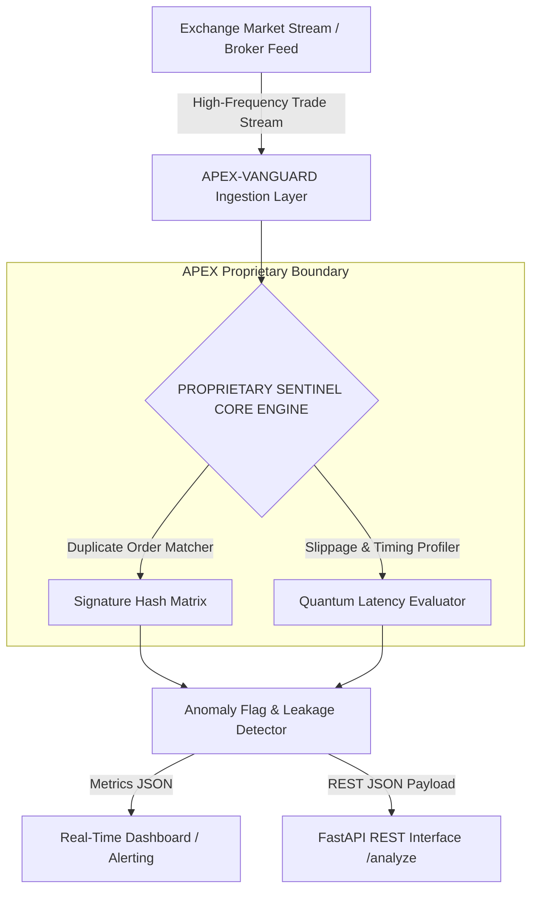

# APEX-VANGUARD Architecture Specifications

## System Topology & Black Box Overview

## Official Tech Stack Table

| Component Layer | Technology | Specification / Purpose |
| :--- | :--- | :--- |
| **Runtime Language** | Python 3.10+ | High-throughput data stream parsing & analytics |
| **REST API Server** | FastAPI & Uvicorn | Asynchronous endpoint processing with OpenAPI Swagger docs |
| **Dashboard UI** | Native Light Server | Real-time monitoring UI served on port 8080 |
| **Container Engine** | Docker & Docker Compose | Multi-container isolated execution environment |
| **Algorithm Core** | Proprietary Black Box | Sub-10ms duplicate trade matching and $12M leakage prevention |
| **Maintainer Contact** | WhatsApp Only | Direct support & institutional access: +91 9492987918 |
